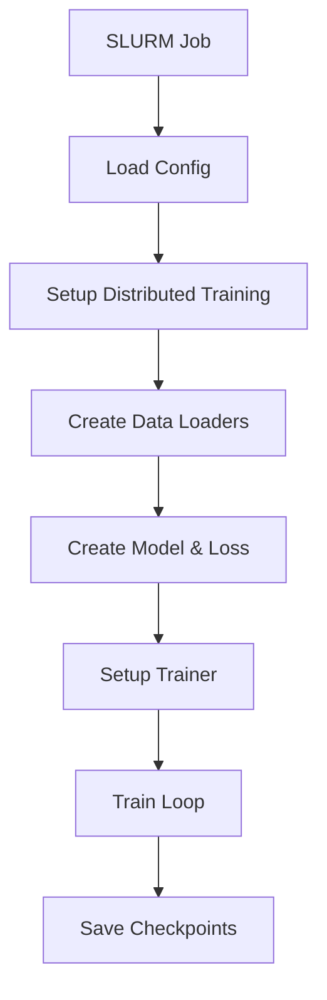

I'll give you a comprehensive overview of the PyTorch emulator codebase structure and then provide a guided tour of the module interactions. Let me start by exploring the directory structure.


Now let me examine the key files to understand the architecture:


Read file: mlmicrophysics/pytorch_emulator/__init__.py

Read file: mlmicrophysics/pytorch_emulator/models/__init__.py

Read file: mlmicrophysics/pytorch_emulator/training/__init__.py
Now let me examine the main training script to understand the entry point:


Read file: mlmicrophysics/pytorch_emulator/scripts/train_streaming_parallel.py
Now let me examine the key model files:


Read file: mlmicrophysics/pytorch_emulator/models/physics_emulator.py
Now let me examine the streaming data loader:


Read file: mlmicrophysics/pytorch_emulator/models/streaming_data_loader.py
Now let me examine the configuration structure:


Read file: mlmicrophysics/pytorch_emulator/configs/streaming_parallel_base.yml
Now let me examine the loss function:


Read file: mlmicrophysics/pytorch_emulator/models/losses.py
Now let me examine the SLURM script to understand the execution flow:


Read file: mlmicrophysics/pytorch_emulator/submit_quick_test.sh
Perfect! Now I have a comprehensive understanding of the codebase. Let me provide you with a detailed overview.

# 🏗️ PyTorch Emulator Codebase Structure Overview

## 📁 **High-Level Directory Structure**

```
pytorch_emulator/
├── 📁 models/                    # Core ML components
│   ├── physics_emulator.py      # Main neural network architecture
│   ├── losses.py                # Custom loss functions
│   ├── streaming_data_loader.py # Memory-efficient data loading
│   └── data_loader.py           # Legacy data loader
├── 📁 training/                 # Training infrastructure
│   ├── parallel_trainer.py      # Multi-GPU training (main)
│   └── trainer.py               # Single-GPU trainer (legacy)
├── 📁 configs/                  # Configuration files
│   ├── streaming_parallel_base.yml    # Production config
│   ├── streaming_parallel_test.yml    # Test config
│   └── [various other configs]
├── 📁 scripts/                  # Execution scripts
│   ├── train_streaming_parallel.py    # Main training script
│   ├── evaluate_model.py        # Model evaluation
│   └── [other utility scripts]
├── submit_quick_test.sh         # SLURM job script
└── README_STREAMING_PARALLEL.md # Documentation
```

## 🎯 **Core Architecture Components**

### 1. **Neural Network Model** (`models/physics_emulator.py`)
- **`ConstraintAwareEmulator`**: Multi-head neural network with physical constraints
- **Architecture**: Shared backbone + specialized heads for classification/regression
- **Physical Constraints**: 
  - `qrtend ≥ 0` (rain formation always positive)
  - `nctend ≤ 0` (cloud droplet loss)
  - Mass conservation: `qctend = -qrtend`

### 2. **Loss Function** (`models/losses.py`)
- **`ConstraintAwareLoss`**: Combined classification + regression loss
- **Components**:
  - Binary Cross-Entropy for active/quiescent detection
  - Huber loss for regression (only on active samples)
  - Mass conservation penalty

### 3. **Data Loading** (`models/streaming_data_loader.py`)
- **`StreamingMicrophysicsDataset`**: Memory-efficient streaming dataset
- **Features**:
  - Chunk-based parquet file reading
  - On-the-fly preprocessing and scaling
  - Memory-efficient shuffling
  - Support for train/validation splits

### 4. **Training Infrastructure** (`training/parallel_trainer.py`)
- **`DataParallelTrainer`**: Multi-GPU training with distributed support
- **Features**:
  - DataParallel and DistributedDataParallel support
  - Mixed precision training (AMP)
  - Gradient accumulation
  - SLURM integration

## 🔄 **Module Interaction Flow**

### **Main Training Pipeline** (`scripts/train_streaming_parallel.py`)



### **Detailed Module Dependencies**

1. **Entry Point**: `submit_quick_test.sh` → `train_streaming_parallel.py`
2. **Configuration**: `configs/streaming_parallel_test.yml` → `load_config()`
3. **Data Pipeline**: 
   - `create_streaming_data_loaders()` → `StreamingMicrophysicsDataset`
   - Handles parquet files → preprocessing → PyTorch tensors
4. **Model Setup**: 
   - `ConstraintAwareEmulator` (from config parameters)
   - `ConstraintAwareLoss` (with constraint weights)
5. **Training**: 
   - `DataParallelTrainer` → handles multi-GPU, mixed precision, checkpointing
6. **Output**: Model checkpoints, scaler cache, training logs

## 🎛️ **Configuration-Driven Architecture**

The system is highly configurable through YAML files:

```yaml
# Key configuration sections:
data:           # Data paths, batch sizes, preprocessing
model:          # Network architecture, constraints
training:       # Optimizer, learning rate, epochs
logging:        # W&B integration, checkpointing
hardware:       # GPU configuration, memory settings
```

## 🚀 **Execution Flow Breakdown**

### **1. Job Submission** (`submit_quick_test.sh`)
- SLURM job configuration (1 GPU, 25 min, debug queue)
- Environment setup (conda, CUDA modules)
- Calls main training script

### **2. Training Script** (`train_streaming_parallel.py`)
- **Config Loading**: Parse YAML configuration
- **Distributed Setup**: Handle multi-GPU/multi-node training
- **Data Loaders**: Create streaming data loaders with scaler fitting
- **Model Creation**: Initialize neural network and loss function
- **Training Loop**: Execute training with checkpointing

### **3. Data Pipeline** (`streaming_data_loader.py`)
- **File Discovery**: Find parquet files in data directory
- **Chunked Reading**: Read data in memory-efficient chunks
- **Preprocessing**: Scale inputs, create targets, handle active/quiescent classification
- **Streaming**: Yield batches without loading entire dataset

### **4. Model Forward Pass** (`physics_emulator.py`)
- **Shared Backbone**: Extract features from inputs
- **Multi-Head Output**: Generate predictions for each target
- **Constraint Enforcement**: Apply physical constraints (ReLU, -ReLU)
- **Mass Conservation**: Derive `qctend = -qrtend`

### **5. Loss Computation** (`losses.py`)
- **Classification Loss**: BCE for active/quiescent detection
- **Regression Loss**: Huber loss on active samples only
- **Conservation Loss**: Penalty for mass conservation violations
- **Combined Loss**: Weighted sum of all components

### **6. Training Loop** (`parallel_trainer.py`)
- **Forward Pass**: Model prediction + loss computation
- **Backward Pass**: Gradient computation with mixed precision
- **Optimization**: Gradient clipping, optimizer step, learning rate scheduling
- **Checkpointing**: Save model state, metrics, scaler

## 🔧 **Key Design Patterns**

1. **Streaming Architecture**: Memory-efficient data loading for large datasets
2. **Constraint-Aware Design**: Physical constraints built into model architecture
3. **Multi-GPU Support**: Automatic detection and setup of parallel training
4. **Configuration-Driven**: All parameters controlled via YAML files
5. **Modular Design**: Clean separation between data, model, training components
6. **HPC Integration**: SLURM support, distributed training, checkpointing

## 📊 **Data Flow Summary**

```
Parquet Files → StreamingDataset → Preprocessing → Model → Loss → Trainer → Checkpoints
     ↓              ↓                    ↓           ↓       ↓        ↓         ↓
   Raw Data    Memory Efficient    Scaled Inputs  Predictions  Losses  Gradients  Saved State
```

This architecture is designed to handle the large-scale microphysics dataset (1.2B+ samples) efficiently while maintaining physical consistency and supporting multi-GPU training for scalability.

Would you like me to dive deeper into any specific component or explain how particular functions work in detail?
